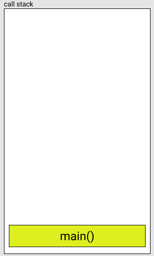
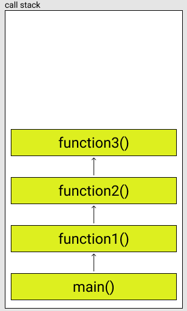
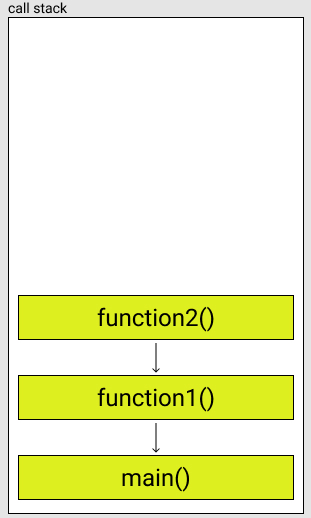
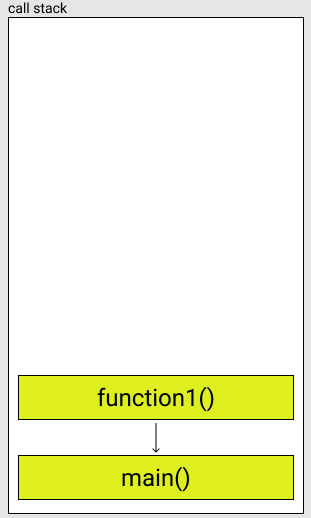

 # Module-6.5
> Recursion, call-stack, rand and srand, termination of strings, the usage of enums, and optimisation tips.

## String termination 
Imagine taking input from the user letter by letter in order to fill a string. You create a loop and iterate over the array taking every character from the user and then you cout them. But here's the problem. Gibberish stuff gets printed and you sit there pulling your hair off. Some of you may have encountered this issue. But there's a fix! In order to overcome this issue you can do one of the following: 
1. Terminate the string after creating it. 
2. Use cin.getline
3. Initialise the string.

#### Terminate the string 
Imagine a 256 characters long cstring. When you create such a string, and try to cout it, the program will look for a termination character "\\0". What this termination character does is it tells the program that the string ends here and you should go no further because there's gibberish data after me. 
```cpp
...

char someString[10]; //Here the compiler will fill the array with random gibberish data
cout << someString; //On my computer this printed "\\" despite not passing any data into the array 

...
``` 
The solution is quite simple yet effective 
```cpp 
... 

char someString [10];
for(int i = 0; i < 10; i++){
  someString[i] = '\\0';
}
cout << someString; //Will print nothing

...
```

#### Using cin.getline()
This function automatically adds a terminating character at the end of the user input. So doing something like this will prove useful.
```cpp
...

char someString[10];
cin.getline(someString, 10); //I input 4 letters
cout << someString; //output only those 4 letters I input 

...
```

#### Initialising the string
When you create the cstring with an initial value a terminating character is automatically placed at the end of your initialisation. Consider: 
```cpp
...

char someString[10] = "abcdef";
cout << someString; //Output only those letters because there's a terminating character after them.

...
```
## The call stack
In the most basic form, when you call a function, that function is placed onto what's known as a call stack. This call stack is basically a place where the computer knows when functions should start and end, what happens when they end, and what happens when they start. It's like a line of patients waiting for their turn in a private clinic for instance. Each person has a specific number and thus is supposed to enter at a specific order. Now, the person responsible for that list can see clearly who should enter first, and thus he orders the people to enter according to the list at hand. Once a patient is finished he is removed from the waiting list and another person takes his places. And the loop continues. Now look at this code: 
```cpp
...

void function3(){
  cout << "Function 3 is now working!\n";
}
void function2(){
  function3();
  cout << "Function 3 has finished and now 2 is continuing!\n" //notice the use of "CONTINUING"
}
void function1(){
  function2();
  cout << "Function 2 has finished and now 1 is continuing!\n"; //notice the use of "CONTINUING"
}
int main(){
  function1();
  cout << "Function 1 has finished and now main is continuing!\n"; //notice the use of "CONTINUING"
} 

...
```
The way this code will execute is at first, the computer will place the `main` function at the bottom of the stack and then inspect it.



When it inspects `main` it will find a call to the function `function1` so it pauses `main` and places that function on top of `main` in the call stack.


And then it inspects `function1` only to find out that it has a call to another function `function2` and so it does the same thing, pause `function1`, place `function2` on the stack and then inspect it.


Then it inspects `function2` to find a call to `function3` so it pauses `function2` and places `function3` on top of `function2` in the stack. 



Now when it inspects `function3` it will not find any other function calls, so it will start the execution phase. The execution phase runs the functions on the stack from top to bottom, so in reverse order of the inspection phase.


After `function3` has finished executing it will be removed from the stack and `function2` will be called. 



After that, it will be removed and `function1` will continue. 



After that, all function calls will have finished and thus the only function remaining will be `main` which will continue operating normally till its end. 


## srand and rand
Ever wondered how you can generate a random number using C++? It's easier than you think! There's already a built-in function that takes care of this for us.

#### The time function
Before we dive into those, let's first learn about the `time()` function. This function returns the current time since the Epoch in type `time_t`. It takes a paramter pointer to type `time_t` and stored its returned value in that variables pointed to by the parameter. You can also pass in a `NULL` pointer to make it only return and not assign. 
```cpp
...

#include <ctime>

...


time_t currentTime;

time(&currentTime);
cout << currentTime << " seconds has passed since 00:00:00 GMT, Jan 1, 1970, the Epoch.";


...
```
or you can do something like this: 
```cpp
...

cout << time(NULL); //This forces it to return a time and not assign any value to pointers since we're passing a NULL pointer.

...
```
#### Generating random numbers
The function used to generate random numbers is called `rand`. What `rand` does is generate a number from 1 to `RAND_MAX`. `RAND_MAX` is a constant set in the `cstdlib` header. It's usually around 32767. 
```cpp
...

cout << rand(); //This will print a random number between 0 and RAND_MAX

...
```
But this is not THAT random in reality. You can think of `rand` as a mathematical function that takes X (which is 1 in this case and we'll know how to change this) and returns Z. What that means is that whenever you run the program, you will always get the same set of random numbers. How can we fix this? This is what `srand` does. It modifies the "range" in which `rand` operates in order to generate numbers from a different set of numbers.
```cpp
...

srand(time(NULL)); //sets a different 'seed' every time the program is run, forcing the rand function to use a different range every time.
cout << rand(); //will ouput numbers different every time the program runs

...
```

#### NOTE
`rand` doesn't take any parameters when it's called.
